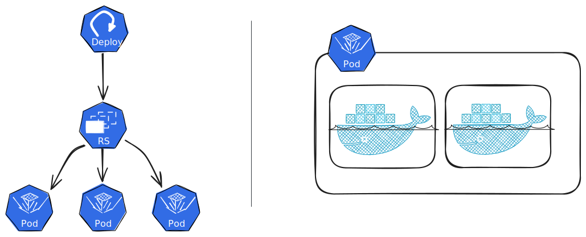

# What is Kubernetes?

While the [Kubernetes docs](https://kubernetes.io/docs/tutorials/kubernetes-basics/) are a great resource, we here present a brief overview of the most important concepts in Kubernetes for our application.

Kubernetes is platform for running (Docker) containers.
The platform lives on one or more machines, and intelligently handles running your containers where there is sufficient resources, managing their lifecycle, allowing you to read logs, and more.

## Components

When getting started, the most confusing part is the terminology, and the different levels of abstraction introduced.
For example, you have:

- Containers
- Pods
- Replica sets
- Deployments
- Services

The fundamental component in Kubernetes is the **Pod**.
Where a container is the smallest unit when running things in Docker or Docker Compose, a Pod is the smallest unit in Kubernetes.
A Pod contains one or more containers;
however, for most simple use cases, it will only contain one, and you may think of a Pod as a single container.

_However_, one very rarely run pods directly.
Much of the power of Kubernetes comes from the higher level abstractions, such as Deployments and Services.



### Deployments

A **Deployment** is the most common way to deploy an application to Kubernetes.
A deployment *declares* a desired state for your application, such as which container image to run, how many replicas to run, and so on.
Kubernetes then takes the necessary steps, such as creating replica sets, pods, etc, to ensure that the actual state matches the desired state.

While the declaration of a deployment may seem very complex, all the parts are actually quite simple, and once you get started, declaring them becomes straightforward.

```yaml
# nginx-deployment.yaml
apiVersion: apps/v1
kind: Deployment
metadata:
  name: nginx-deployment
  labels:
    app: nginx
spec:
  replicas: 3
  selector:
    matchLabels:
      app: nginx
  template:
    metadata:
      labels:
        app: nginx
    spec:
      containers:
      - name: nginx
        image: nginx:1.14.2
        ports:
        - containerPort: 80
```

### Services

When running an application, we often want to expose it, either to the outside world, or to other applications running in the same Kubernetes cluster.
Unlike Docker Compose, it is not enough to just expose a container port, like the `containerPort: 80` in the example above.
We must also create a logical abstraction, called a **Service**, that allows the pod(s) to be reached.

In simple terms, a Service is a way to group pods together and expose them under a single name.
For example, if we run three pods (replicas) like the nginx deployment above, we can create a service that allows us to reach all three pods under the name `nginx-service`.
Since all pods (replicas) are expected to run the same application, the inbound traffic will load balance requests between them.

```yaml
# nginx-service.yaml
apiVersion: v1
kind: Service
metadata:
  name: my-nginx
  labels:
    run: my-nginx
spec:
  ports:
  - port: 80
    protocol: TCP
  selector:
    run: my-nginx
```
